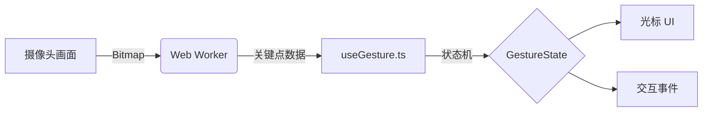

# 手势控制模块

本模块提供了一个基于 MediaPipe 的高性能手势识别系统，专为 Vue 3 应用设计。系统捕获视频帧并将其发送给 **Web Worker**。Worker 运行 MediaPipe 的手势识别器以提取 3D 手部关键点。这些原始数据被传回主线程，并处理为 `GestureState`（手势状态）。

使用 **动态 ROI **来适应手离屏幕的远近：
- 当你的手 **靠近** 摄像头时，光标进行 1:1 映射。
- 当你的手 **远离** 时，交互区域会缩小，让你只需微小的手部动作即可触及屏幕的四个角落。



## 架构

| 文件 | 描述 |
|------|-------------|
| `src/composables/useGesture.ts` | **核心逻辑**。管理 Worker 和摄像头，并将关键点转换为光标坐标和手势（点击、拖拽、滚动）。 |
| `src/components/GestureCursor.vue` | **视觉组件**。悬浮光标，根据手势模式（如点击时圆环闭合）改变视觉状态。 |
| `src/utils/GestureInteraction.ts` | **事件桥接**。将手势状态转换为实际的交互事件（可选辅助工具）。 |
| `src/components/SettingPanel.vue` | **调试 UI**。允许切换摄像头、更改左右手偏好以及查看性能日志。 |
| `public/mediapipe.js` | **MediaPipe 加载器**。Worker 所需的静态资源。 |

## 功能

- **动态光标映射**：无论距离远近，都能舒适地控制全屏。
- **手势集**：
  - 👆 **指点 (Point)**：移动光标。
  - 👌 **捏合 (Pinch - 食指+拇指)**：点击（短按），拖拽（长按）。
  - **中指捏合 (Middle Pinch)**：旋转 / 特殊操作。
- **可配置**：支持调节平滑度、左右手偏好以及切换摄像头源。

## 集成指南

### 1. 设置静态资源
确保你的 `public/` 文件夹包含 MediaPipe 的库文件和模型。
```
public/
  ├── mediapipe.js
  ├── libs/
  │   ├── vision_wasm_internal.js
  │   └── vision_wasm_internal.wasm
  └── models/
      └── gesture_recognizer.task
```

### 2. 使用 Composition API
在你的根组件（例如 `App.vue`）中导入 composable。

```typescript
import { onMounted } from 'vue';
import { useGesture } from './composables/useGesture';

// 初始化系统
const { 
  initWorker, 
  startCamera, 
  gestureState 
} = useGesture();

onMounted(() => {
  initWorker();
  // 可选：立即启动摄像头或等待用户操作
  // startCamera();
});
```

### 3. 添加光标组件
将 `GestureCursor` 组件放置在模板的根部，以显示手势位置。

```vue
<template>
  <div id="app">
    <!-- 你的应用内容 -->
    
    <!-- 手势光标层 -->
    <GestureCursor 
      :x="gestureState.cursor.x" 
      :y="gestureState.cursor.y" 
      :mode="gestureState.cursor.mode"
      :active="gestureState.cursor.active"
    />
  </div>
</template>
```

> [!TIP]
> 开发过程中建议使用 `SettingPanel.vue` 来方便地调试摄像头视图和 Worker 状态。

> [!WARNING]
> 如果你不使用 Vite，请确保你的服务器已配置为正确服务 `.wasm` 文件。